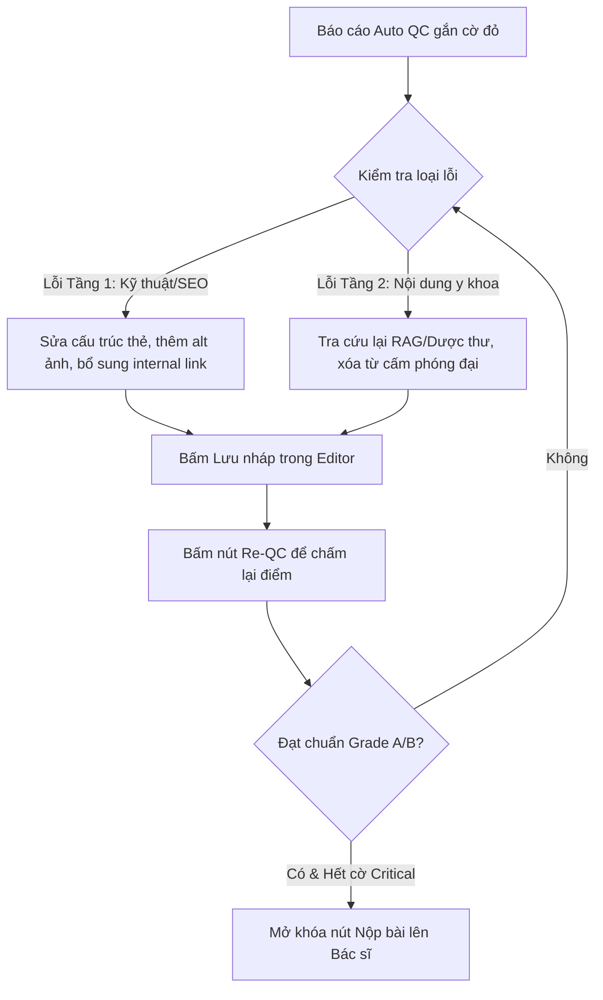

# 📘 CẨM NANG & TEMPLATE NỘI DUNG Y KHOA CHI TIẾT
## FPT LONG CHÂU CONTENT STUDIO — PHIÊN BẢN CHUẨN HOÁ V3.0

> **Dành cho:** Biên tập viên (BTV), Cộng tác viên (CTV), Bác sĩ (BS) và làm cơ sở dữ liệu huấn luyện Hệ thống AI (System Prompt).
> **Mục tiêu:** Đảm bảo 100% bài viết y khoa đạt chuẩn SEO, có cấu trúc Heading chặt chẽ, chính xác về mặt y học và vượt qua 2 tầng kiểm duyệt của Auto QC Engine.

---

## 📖 MỤC LỤC PHÂN NHÓM NỘI DUNG
*   [Quy Định Chung Cho Toàn Bộ Nội Dung](#-quy-định-chung-cho-toàn-bộ-nội-dung)
*   [📚 NHÓM 1: THƯ VIỆN Y KHOA (HỌC THUẬT CAO)](#-nhóm-1-thư-viện-y-khoa-học-thuật-cao)
    *   [I. Template BỆNH LÝ (Disease)](#i-template-bệnh-lý-disease)
    *   [II. Template DƯỢC CHẤT (Active Ingredient)](#ii-template-dược-chất-active-ingredient)
    *   [III. Template THUỐC (Drug)](#iii-template-thuốc-drug)
    *   [IV. Template DƯỢC LIỆU (Herbal)](#iv-template-dược-liệu-herbal)
    *   [V. Template VẮC XIN LẺ (Vaccine)](#v-template-vắc-xin-lẻ-vaccine)
*   [👥 NHÓM 2: BÀI VIẾT CỘNG ĐỒNG (CHIA SẺ & PHỔ THÔNG)](#-nhóm-2-bài-viết-cộng-đồng-chia-sẻ--phổ-thông)
    *   [VI. Template TPCN / CSCN / TTBYT (Non-Drug)](#vi-template-tpcn--cscn--ttbyt-non-drug)
    *   [VII. Template BLOG SỨC KHỎE (GSK Blog)](#vii-template-blog-sức-khỏe-gsk-blog)
    *   [VIII. Template HỎI ĐÁP BÁC SĨ (Q&A Doctor)](#viii-template-hỏi-đáp-bác-sĩ-qa-doctor)
*   [📊 Bảng Tra Cứu Chấm Điểm Auto QC (Tầng 1 & Tầng 2)](#-bảng-tra-cứu-chấm-điểm-auto-qc-tầng-1--tầng-2)
*   [🔄 Hướng Dẫn Quy Trình Chỉnh Sửa & Khắc Phục Lỗi Cờ Đỏ](#-hướng-dẫn-quy-trình-chỉnh-sửa--khắc-phục-lỗi-cờ-đỏ)

---

## 🛠️ QUY ĐỊNH CHUNG CHO TOÀN BỘ NỘI DUNG

### 1. Quy tắc chính tả & Tên gọi chuyên môn
*   **Viết thường tên hoạt chất/thuốc:** Tên các hoạt chất hóa học và thuốc phải viết thường (ví dụ: *paracetamol*, *ibuprofen*, *amoxicillin*), trừ khi đứng đầu câu hoặc là tên thương mại riêng biệt (như *Panadol*, *Decolgen*).
*   **Danh pháp y học:** Ưu tiên sử dụng danh pháp y học thuần Việt hoặc từ mượn Hán-Việt đã phổ biến (ví dụ: dùng *tăng huyết áp* thay cho *cao huyết áp*, dùng *đái tháo đường* thay cho *tiểu đường* trong các văn bản y khoa chính thống).
*   **Nguồn tham khảo học thuật bắt buộc:** Chỉ trích dẫn từ các nguồn uy tín:
    *   *Dược thư Quốc gia Việt Nam* (đối với thuốc và hoạt chất).
    *   *Bộ Y Tế Việt Nam*, *Tổ chức Y tế Thế giới (WHO)*, *CDC Hoa Kỳ*, *FDA*.
    *   Các thư viện y khoa lớn: *PubMed*, *Medline*, *Mayo Clinic*, *WebMD*, *Cleveland Clinic*.

### 2. Nguyên tắc phân cấp Headings (Heading Hierarchy)
*   **Quy tắc bất biến:** Không nhảy cấp Heading. Phải sắp xếp tuần tự `H1` -> `H2` -> `H3` -> `H4`.
*   **Cấm:** Sử dụng thẻ `H3` trực tiếp dưới thẻ `H1` mà không có thẻ `H2` ngăn cách.
*   **Chỉ định:** Tên bài viết là `H1` (chỉ có duy nhất một `H1` trong bài). Các mục lớn là `H2`. Các mục con bổ trợ chi tiết cho `H2` là `H3`.

### 3. Yêu cầu An toàn y tế & Từ ngữ cấm (Banned Words)
*   **Tuyệt đối cấm:** Sử dụng các từ khẳng định tuyệt đối hoặc mang tính quảng cáo sai sự thật như: `"trị dứt điểm"`, `"chữa khỏi 100%"`, `"cam kết khỏi bệnh"`, `"an toàn tuyệt đối"`, `"thuốc tiên"`, `"không tác dụng phụ"`.
*   **Tuyên bố miễn trừ trách nhiệm y khoa:** Mọi bài viết thuộc nhóm Bệnh lý, Thuốc, Dược chất, TPCN phải có câu kết thúc: *"Nội dung bài viết chỉ mang tính chất tham khảo. Người bệnh không được tự ý áp dụng, cần hỏi ý kiến bác sĩ hoặc dược sĩ chuyên môn trước khi sử dụng."*

---

## 📚 NHÓM 1: THƯ VIỆN Y KHOA (HỌC THUẬT CAO)
*Nhóm bài viết yêu cầu tính chuẩn xác y khoa tuyệt đối, tuân thủ chặt chẽ phác đồ điều trị và tài liệu y học chính thống (như Bộ Y tế, Dược thư Quốc gia).*

---

### I. Template BỆNH LÝ (Disease)

> **Thông số cấu hình:**
> *   **Độ dài tối thiểu:** 1800 từ.
> *   **Giọng văn:** Chuyên gia, thấu cảm, dễ hiểu đối với độc giả phổ thông nhưng tuyệt đối chính xác về mặt y khoa.
> *   **Mục tiêu:** Giải thích cặn kẽ về bệnh lý, giúp người bệnh nhận biết dấu hiệu nguy hiểm và hướng dẫn họ đi khám đúng chuyên khoa.

#### Bản Markdown Template Mẫu (Copy & Sử dụng)
```markdown
# [Tên bệnh] là gì? Triệu chứng, nguyên nhân và cách điều trị hiệu quả

## Mô tả ngắn (Sapo)
<!-- Mô tả ngắn dưới 300 ký tự: Định nghĩa ngắn gọn nhất về bệnh + mức độ ảnh hưởng/phổ biến trong cộng đồng. Chứa từ khóa chính. -->

## Tìm hiểu chung
### Bệnh [Tên bệnh] là gì?
<!-- Định nghĩa khoa học, cơ chế gây bệnh cơ bản bằng ngôn ngữ dễ hiểu. -->

## Triệu chứng lâm sàng
### Dấu hiệu nhận biết bệnh [Tên bệnh]
<!-- Liệt kê chi tiết các dấu hiệu của bệnh theo từng giai đoạn (nếu có). Sử dụng bullet points. -->
- Triệu chứng sớm: ...
- Triệu chứng điển hình: ...
- Triệu chứng toàn thân: ...

### Tác động của bệnh đến đời sống bệnh nhân
<!-- Ảnh hưởng tới sinh hoạt, tâm lý, công việc và sức khỏe thể chất lâu dài. -->

### Biến chứng nguy hiểm của bệnh
<!-- Các biến chứng nghiêm trọng nếu không phát hiện và điều trị kịp thời. -->
- Biến chứng cấp tính: ...
- Biến chứng mãn tính/lâu dài: ...

### Khi nào cần đi gặp bác sĩ?
<!-- Các dấu hiệu "cờ đỏ" nguy cấp (Red Flags) báo hiệu bệnh nhân phải nhập viện hoặc khám ngay lập tức. -->

## Nguyên nhân gây bệnh
<!-- Các tác nhân trực tiếp, cơ chế sinh bệnh học lý giải tại sao mắc bệnh. -->

## Yếu tố nguy cơ & Đối tượng dễ mắc bệnh
### Nhóm đối tượng có nguy cơ cao
<!-- Tuổi tác, giới tính, nghề nghiệp, tiền sử gia đình... -->

### Yếu tố nguy cơ làm tăng khả năng mắc bệnh
<!-- Lối sống kém lành mạnh, thói quen ăn uống, môi trường ô nhiễm, stress... -->

## Chẩn đoán & Điều trị y khoa
### Phương pháp chẩn đoán bệnh [Tên bệnh]
<!-- Các kỹ thuật lâm sàng và cận lâm sàng chuyên khoa thường dùng. -->
- Khám lâm sàng: ...
- Xét nghiệm cận lâm sàng (máu, nước tiểu...): ...
- Chẩn đoán hình ảnh (Siêu âm, X-quang, CT, MRI...): ...

### Phương pháp điều trị nội khoa (Sử dụng thuốc)
<!-- Liệt kê nhóm thuốc cơ bản theo phác đồ, lưu ý không tự ý mua thuốc điều trị. -->

### Phương pháp điều trị ngoại khoa & Can thiệp khác (nếu có)
<!-- Phẫu thuật, trị liệu vật lý, can thiệp ít xâm lấn... -->

## Chế độ sinh hoạt & Phòng ngừa
### Thói quen sinh hoạt cho người bệnh [Tên bệnh]
<!-- Chế độ nghỉ ngơi, thói quen sinh hoạt tốt cho việc điều trị. -->

### Chế độ dinh dưỡng phù hợp
<!-- Thực phẩm nên ăn và thực phẩm cần kiêng kị đối với bệnh nhân. -->
- Thực phẩm nên ăn: ...
- Thực phẩm nên tránh: ...

### Phòng ngừa đặc hiệu (nếu có)
<!-- Vắc-xin phòng bệnh, thuốc dự phòng đặc hiệu. -->

### Biện pháp phòng ngừa chung
<!-- Các lối sống lành mạnh giúp giảm thiểu nguy cơ mắc bệnh cho người khỏe mạnh. -->

## Câu hỏi thường gặp (FAQ)
### [Câu hỏi 1: Ví dụ: Bệnh [Tên bệnh] có lây không?]
- **Trả lời:** [Câu trả lời chi tiết và khoa học dưới 150 từ]

### [Câu hỏi 2: Ví dụ: Bệnh [Tên bệnh] có chữa khỏi hoàn toàn được không?]
- **Trả lời:** [Câu trả lời chi tiết và khoa học dưới 150 từ]

### [Câu hỏi 3: Ví dụ: Chi phí điều trị [Tên bệnh] khoảng bao nhiêu?]
- **Trả lời:** [Câu trả lời chi tiết và khoa học dưới 150 từ]

### [Câu hỏi 4: Ví dụ: Người bị [Tên bệnh] cần kiêng ăn gì?]
- **Trả lời:** [Câu trả lời chi tiết và khoa học dưới 150 từ]

### [Câu hỏi 5: Ví dụ: Bệnh [Tên bệnh] có di truyền không?]
- **Trả lời:** [Câu trả lời chi tiết và khoa học dưới 150 từ]

## Nguồn tham khảo
- [1] Bộ Y tế Việt Nam - Quyết định số [Số quyết định] về việc ban hành Hướng dẫn chẩn đoán và điều trị bệnh [Tên bệnh].
- [2] World Health Organization (WHO) - [Tên bài viết gốc/Báo cáo y khoa tiếng Anh].
- [3] Mayo Clinic - [Tên bài viết về bệnh].

*Nội dung bài viết chỉ mang tính chất tham khảo. Người bệnh không được tự ý áp dụng, cần hỏi ý kiến bác sĩ hoặc dược sĩ chuyên môn trước khi sử dụng.*
```

---

### II. Template DƯỢC CHẤT (Active Ingredient)

> **Thông số cấu hình:**
> *   **Độ dài tối thiểu:** 1500 từ.
> *   **Giọng văn:** Khoa học chuyên sâu, học thuật hàn lâm, dành cho những ai muốn tìm hiểu sâu về bản chất hóa học, sinh học của hoạt chất.
> *   **Mục tiêu:** Cung cấp hồ sơ chi tiết của một dược chất về cơ chế tác động, động học trong cơ thể và độc tính liên quan.

#### Bản Markdown Template Mẫu (Copy & Sử dụng)
```markdown
# Hoạt chất [Tên dược chất]: Cơ chế dược lý, dược động học và chỉ định lâm sàng

## Mô tả ngắn (Sapo)
<!-- Mô tả ngắn dưới 300 ký tự: Định nghĩa dược chất là gì, thuộc nhóm hóa học/phân loại nào, hoạt chất này là thành phần cốt lõi của các nhóm thuốc nào. -->

## Tổng quan dược chất
*   **Tên quốc tế (INN):** [Ví dụ: Paracetamol, Atorvastatin...]
*   **Công thức hóa học:** [Ví dụ: C8H9NO2]
*   **Nhóm dược lý:** [Ví dụ: Dẫn xuất Anilin, Thuốc ức chế men khử HMG-CoA...]

## Chỉ định điều trị lâm sàng
<!-- Các bệnh lý và triệu chứng được phép sử dụng hoạt chất này trong điều trị y khoa chính thống. -->

## Đặc tính dược lý học chuyên sâu
### Cơ chế tác dụng (Dược lực học - Pharmacodynamics)
<!-- Giải thích chi tiết cơ chế tương tác với các receptor, enzyme trong cơ thể để tạo ra hiệu ứng điều trị. -->

### Số phận của hoạt chất trong cơ thể (Dược động học - Pharmacokinetics)
<!-- Mô tả chi tiết 4 quá trình của dược động học: -->
*   **Hấp thu (Absorption):** [Sinh khả dụng qua đường uống/tiêm, tốc độ đạt nồng độ đỉnh...]
*   **Phân bố (Distribution):** [Tỷ lệ liên kết protein huyết tương, khả năng qua hàng rào máu não/nhau thai...]
*   **Chuyển hóa (Metabolism):** [Chuyển hóa chủ yếu qua cơ quan nào (ví dụ: enzyme CYP450 ở gan)...]
*   **Thải trừ (Elimination):** [Thời gian bán thải (t1/2), đào thải qua nước tiểu hay phân...]

### Độc tính & Tính an toàn của dược chất
<!-- Độc tính cấp tính khi quá liều, độc tính mãn tính nếu dùng kéo dài (độc gan, độc thận...). -->

## Tương tác dược chất & Chống chỉ định
### Chống chỉ định
<!-- Đối tượng bệnh lý chống chỉ định dùng hoạt chất này. -->

### Tương tác với hoạt chất khác (Drug-Drug Interactions)
<!-- Các tương tác làm tăng/giảm nồng độ thuốc, gây nguy hiểm cho người bệnh. -->

## Liều lượng khuyến cáo & Đường dùng
<!-- Phác đồ liều chuẩn cho các đường dùng khác nhau (Uống, tiêm tĩnh mạch, tiêm bắp...). -->

## Lưu ý đặc biệt trên các đối tượng lâm sàng
*   **Suy giảm chức năng gan/thận:** [Điều chỉnh liều thế nào?]
*   **Người cao tuổi:** [Nguy cơ tích lũy thuốc, cần lưu ý gì?]
*   **Thai kỳ và cho con bú:** [Phân loại mức độ an toàn cho thai nhi.]

## Nguồn tham khảo
- [1] *Dược thư Quốc gia Việt Nam*.
- [2] *Martindale: The Complete Drug Reference*.
- [3] PubChem Compound Database - National Center for Biotechnology Information (NCBI).

*Nội dung bài viết chỉ mang tính chất tham khảo. Người bệnh không được tự ý áp dụng, cần hỏi ý kiến bác sĩ hoặc dược sĩ chuyên môn trước khi sử dụng.*
```

---

### III. Template THUỐC (Drug)

> **Thông số cấu hình:**
> *   **Độ dài tối thiểu:** 1500 từ.
> *   **Giọng văn:** Cực kỳ thận trọng, mang tính chất của một Dược sĩ lâm sàng cấp cao. Tuyệt đối không tự ý bịa đặt hoặc sáng tạo liều dùng.
> *   **Mục tiêu:** Cung cấp hướng dẫn sử dụng thuốc an toàn, đúng liều lượng, phòng tránh tương tác và tác dụng phụ nguy hiểm.

#### Bản Markdown Template Mẫu (Copy & Sử dụng)
```markdown
# Thuốc [Tên thuốc]: Công dụng, liều dùng, tác dụng phụ và lưu ý thận trọng

## Mô tả ngắn (Sapo)
<!-- Mô tả ngắn dưới 300 ký tự: Phân nhóm thuốc (ví dụ: Kháng sinh, giảm đau hạ sốt...), hoạt chất chính và ứng dụng lâm sàng phổ biến nhất. -->

## Thông tin chung về thuốc
*   **Tên gốc (Hoạt chất):** *[Tên hoạt chất viết thường]*
*   **Tên thương hiệu phổ biến:** [Ví dụ: Panadol, Efferalgan...]
*   **Dạng bào chế và hàm lượng:** [Viên nén 500mg, hỗn dịch uống 120mg/5ml, thuốc tiêm...]
*   **Nhóm dược lý:** [Thuốc kháng viêm không Steroid, Kháng sinh Beta-lactam...]

## Công dụng & Chỉ định điều trị
<!-- Thuốc được bác sĩ chỉ định dùng cho các trường hợp bệnh lý cụ thể nào? -->

## Hướng dẫn Liều dùng & Cách sử dụng
<!-- Yêu cầu độ chính xác tuyệt đối theo Dược thư Quốc gia. Phân chia rõ ràng. -->
### Liều dùng cho người lớn
- Liều thông thường: ...
- Liều tối đa trong 24 giờ: ...

### Liều dùng cho trẻ em
- Tính theo cân nặng (mg/kg/ngày) hoặc theo nhóm tuổi cụ thể: ...

### Hướng dẫn cách dùng thuốc
- Uống trước hay sau ăn? Uống với nhiều nước không? Có được bẻ hay nhai viên thuốc không?

## Tác dụng phụ không mong muốn (Adverse Effects)
<!-- Liệt kê tác dụng phụ và cách xử lý tương ứng. -->
*   **Tác dụng phụ thường gặp:** [Buồn nôn, tiêu chảy, nhức đầu...]
*   **Tác dụng phụ ít gặp/hiếm gặp:** [Dị ứng da, giảm bạch cầu...]
*   **Tác dụng phụ nghiêm trọng cần cấp cứu:** [Hội chứng Stevens-Johnson, suy gan cấp...]

## Lưu ý thận trọng & Chống chỉ định
### Chống chỉ định (Những ai tuyệt đối không được dùng?)
<!-- Mẫn cảm hoạt chất, suy gan/thận nặng, loét dạ dày tiến triển... -->

### Thận trọng khi sử dụng
<!-- Cảnh báo sử dụng cho người già, người suy giảm chức năng gan/thận nhẹ. -->

### Ảnh hưởng đến khả năng lái xe và vận hành máy móc
<!-- Có gây buồn ngủ, chóng mặt không? -->

### Sử dụng thuốc cho phụ nữ mang thai & cho con bú
*   **Thời kỳ mang thai:** [Thuộc nhóm phân loại thai kỳ nào của FDA (A, B, C, D, X)? Có dùng được không?]
*   **Thời kỳ cho con bú:** [Hoạt chất có bài tiết qua sữa mẹ không? Có an toàn cho trẻ sơ sinh?]

## Tương tác thuốc (Drug Interactions)
<!-- Các loại thuốc, thực phẩm, hoặc đồ uống (như rượu, bia) tránh dùng chung vì gây tăng độc tính hoặc giảm hiệu quả của thuốc. -->

## Hướng dẫn xử lý khi quá liều hoặc quên liều
### Trường hợp sử dụng quá liều
- Triệu chứng quá liều: ...
- Biện pháp xử lý khẩn cấp tại nhà và y tế: ...

### Trường hợp quên một liều thuốc
- Hướng dẫn bù liều hoặc bỏ qua liều đã quên. Tuyệt đối không uống gấp đôi liều để bù.

## Hướng dẫn bảo quản thuốc
<!-- Nhiệt độ bảo quản thích hợp (dưới 30 độ C), tránh ánh sáng trực tiếp, xa tầm tay trẻ em. -->

## Nguồn tham khảo
- [1] *Dược thư Quốc gia Việt Nam*, Bộ Y tế ban hành.
- [2] Hướng dẫn sử dụng thuốc ban hành kèm theo số đăng ký lưu hành của Bộ Y tế.
- [3] EMC (Electronic Medicines Compendium) Anh Quốc.

*Nội dung bài viết chỉ mang tính chất tham khảo. Người bệnh không được tự ý áp dụng, cần hỏi ý kiến bác sĩ hoặc dược sĩ chuyên môn trước khi sử dụng.*
```

---

### IV. Template DƯỢC LIỆU (Herbal)

> **Thông số cấu hình:**
> *   **Độ dài tối thiểu:** 1200 từ.
> *   **Giọng văn:** Khách quan, khoa học, kết hợp hài hòa giữa tri thức Đông y cổ truyền và nghiên cứu thực chứng Tây y hiện đại.
> *   **Mục tiêu:** Cung cấp thông tin nhận dạng đặc điểm tự nhiên, công dụng điều trị và các bài thuốc dân gian an toàn từ thảo dược.

#### Bản Markdown Template Mẫu (Copy & Sử dụng)
```markdown
# Tìm hiểu về dược liệu [Tên dược liệu]: Công dụng, liều dùng và bài thuốc quý

## Mô tả ngắn (Sapo)
<!-- Mô tả ngắn dưới 300 ký tự: Giới thiệu tổng quan về dược liệu, vùng trồng và ứng dụng nổi bật nhất của nó. -->

## Thông tin khoa học cơ bản
*   **Tên thường gọi:** [Tên tiếng Việt phổ biến]
*   **Tên gọi khác:** [Tên chữ Hán, tên địa phương, tên đồng nghĩa]
*   **Tên khoa học:** *[Tên khoa học viết nghiêng]* (Ví dụ: *Panax ginseng*)
*   **Họ thực vật:** Họ [Tên họ thực vật] (Ví dụ: Họ Nhân sâm - Araliaceae)

## Đặc điểm tự nhiên & Phân bố
### Đặc điểm hình thái thực vật
<!-- Mô tả chi tiết về thân, lá, hoa, quả, rễ/củ của cây để tránh nhầm lẫn với cây khác. -->

### Phân bố địa lý, thu hái và chế biến
<!-- Cây mọc nhiều ở đâu? Mùa vụ thu hoạch? Quy trình sơ chế và bào chế để làm thuốc. -->

### Bộ phận dùng làm dược liệu
<!-- Nêu rõ bộ phận nào của cây được dùng: Lá, thân, vỏ, rễ, hoa, hạt... -->

## Thành phần hóa học chủ yếu
<!-- Liệt kê các hoạt chất sinh học chính có trong dược liệu đem lại công dụng chữa bệnh (ví dụ: Saponin, Flavonoid, Alcaloid...). -->

## Công dụng của dược liệu [Tên dược liệu]
### Theo Y học cổ truyền (Đông y)
<!-- Tính vị, quy kinh, công năng, chủ trị của dược liệu theo các sách y văn cổ. -->

### Theo Y học hiện đại (Tây y)
<!-- Các kết quả nghiên cứu khoa học, thử nghiệm lâm sàng chứng minh tác dụng sinh học của cây. -->

## Liều dùng & Phương pháp sử dụng
<!-- Liều dùng khuyến cáo hàng ngày (gam/ngày). Cách dùng: Sắc uống, hãm trà, ngâm rượu, đắp ngoài... -->

## Bài thuốc kinh nghiệm dân gian
<!-- Liệt kê 3-5 bài thuốc nổi tiếng sử dụng dược liệu này làm chủ vị. Ghi rõ tỷ lệ các vị thuốc phối hợp. -->
### Bài thuốc 1: Điều trị [Tên chứng bệnh]
- Thành phần: ...
- Cách thực hiện: ...

### Bài thuốc 2: Điều trị [Tên chứng bệnh]
- Thành phần: ...
- Cách thực hiện: ...

## Lưu ý & Chống chỉ định khi sử dụng
<!-- Cảnh báo tác dụng phụ khi quá liều. Nhóm đối tượng tuyệt đối không được dùng (phụ nữ có thai, người có thể hàn/nhiệt...). Tương tác với thuốc Tây y. -->

## Nguồn tham khảo
- [1] Đỗ Tất Lợi (2004), *Những cây thuốc và vị thuốc Việt Nam*, Nhà xuất bản Y học.
- [2] Viện Dược liệu Việt Nam, *Cây thuốc và động vật làm thuốc ở Việt Nam*, Nhà xuất bản Khoa học và Kỹ thuật.

*Nội dung bài viết chỉ mang tính chất tham khảo. Người bệnh không được tự ý áp dụng, cần hỏi ý kiến bác sĩ hoặc dược sĩ chuyên môn trước khi sử dụng.*
```

---

### V. Template VẮC XIN LẺ (Vaccine)

> **Thông số cấu hình:**
> *   **Độ dài tối thiểu:** 800 từ.
> *   **Giọng văn:** Rõ ràng, khuyến khích y học dự phòng, tạo dựng niềm tin khoa học cho phụ huynh và người đi tiêm chủng.
> *   **Mục tiêu:** Cung cấp thông tin loại vắc-xin, phác đồ tiêm ngừa chuẩn xác và cách theo dõi sau tiêm.

#### Bản Markdown Template Mẫu (Copy & Sử dụng)
```markdown
# Thông tin chi tiết vắc xin [Tên vắc xin]: Phác đồ tiêm và lưu ý quan trọng

## Mô tả ngắn (Sapo)
<!-- Mô tả ngắn dưới 300 ký tự: Vắc xin phòng bệnh gì, nước sản xuất, công nghệ sản xuất, dành cho đối tượng nào. -->

## Tổng quan về vắc xin [Tên vắc xin]
*   **Tên thương mại:** [Ví dụ: Infanrix Hexa, Hexaxim...]
*   **Nhà sản xuất / Nguồn gốc:** [Tên hãng sản xuất] - [Quốc gia]
*   **Công nghệ vắc xin:** [Vắc xin bất hoạt/sống giảm độc lực/tái tổ hợp...]
*   **Bệnh phòng ngừa:** [Liệt kê các bệnh vắc xin phòng chống được]

## Sự nguy hiểm của các bệnh liên quan
<!-- Giải thích ngắn gọn tại sao cần tiêm vắc xin này thông qua sự nguy hiểm và tốc độ lây lan của bệnh đích. -->

## Phác đồ & Lịch tiêm chi tiết
<!-- Đây là phần cốt lõi quan trọng. Cần ghi cực kỳ chi tiết theo từng nhóm tuổi. -->
### Lịch tiêm cho trẻ em
- Mũi 1: ...
- Mũi 2: ...
- Mũi 3: ...
- Mũi nhắc lại (booster): ...

### Lịch tiêm cho người lớn (nếu có)
- Phác đồ cơ bản: ...
- Lịch tiêm nhắc: ...

## Đối tượng chỉ định & Chống chỉ định
### Đối tượng được chỉ định tiêm chủng
<!-- Độ tuổi bắt đầu tiêm, nhóm đối tượng nguy cơ cao cần tiêm ngay. -->

### Chống chỉ định tiêm ngừa
*   **Chống chỉ định tuyệt đối:** [Đối tượng sốc phản vệ mũi trước, dị ứng thành phần...]
*   **Chống chỉ định tạm thời (Hoãn tiêm):** [Đối tượng đang sốt cao, nhiễm trùng cấp tính...]

## Quy tắc chuyển đổi và thay thế vắc xin (Interchangeability)
<!-- Hướng dẫn trường hợp hết thuốc hoặc muốn đổi sang vắc xin của hãng khác có tương đương không? Điều kiện chuyển đổi. -->

## Tác dụng phụ thường gặp & Hướng dẫn theo dõi sau tiêm
### Phản ứng thông thường sau khi tiêm
- Sốt nhẹ, sưng đau tại chỗ tiêm, quấy khóc nhẹ...
### Phản ứng nghiêm trọng cần nhập viện ngay
- Sốt cao co giật, khó thở, sốc phản vệ, tím tái, khóc thét kéo dài...
### Hướng dẫn chăm sóc tại nhà
- Cách lau mát hạ sốt, theo dõi nhiệt độ, tuyệt đối không đắp lá/thuốc vào vết tiêm...

## Câu hỏi thường gặp (FAQ)
### [Câu hỏi 1: Phụ nữ mang thai có tiêm vắc xin [Tên vắc xin] được không?]
- **Trả lời:** [Giải đáp chi tiết khoa học]

### [Câu hỏi 2: Nếu tiêm trễ lịch hẹn thì có phải tiêm lại từ đầu không?]
- **Trả lời:** [Giải đáp chi tiết khoa học]

## Nguồn tham khảo
- [1] Cục Y tế dự phòng - Bộ Y tế Việt Nam.
- [2] Hướng dẫn sử dụng của nhà sản xuất đính kèm sản phẩm vắc xin [Tên vắc xin].
```

---

## 👥 NHÓM 2: BÀI VIẾT CỘNG ĐỒNG (CHIA SẺ & PHỔ THÔNG)
*Nhóm bài viết hướng tới độc giả đại chúng, mang tính chất chia sẻ kiến thức chăm sóc sức khỏe, giới thiệu sản phẩm hỗ trợ hoặc tư vấn hỏi đáp trực quan.*

---

### VI. Template TPCN / CSCN / TTBYT (Non-Drug)

> **Thông số cấu hình:**
> *   **Độ dài tối thiểu:** 1000 từ.
> *   **Giọng văn:** Khách quan, nhấn mạnh tính chất hỗ trợ sức khỏe, bảo vệ người tiêu dùng.
> *   **Mục tiêu:** Cung cấp thông tin sản phẩm Thực phẩm chức năng (TPCN), Mỹ phẩm chăm sóc cá nhân (CSCN) hoặc Trang thiết bị y tế (TTBYT) gia đình giúp nâng cao thể trạng, phòng ngừa bệnh.

#### Bản Markdown Template Mẫu (Copy & Sử dụng)
```markdown
# Đánh giá [Tên sản phẩm]: Công dụng, thành phần và cách dùng an toàn hiệu quả

## Mô tả ngắn (Sapo)
<!-- Mô tả ngắn dưới 300 ký tự: Nêu rõ đây là sản phẩm gì (TPCN, sữa công thức, máy đo huyết áp...), thương hiệu, xuất xứ và công dụng chính. -->

## Giới thiệu tổng quan về sản phẩm
*   **Tên sản phẩm:** [Tên đầy đủ của sản phẩm trên nhãn hộp]
*   **Thương hiệu:** [Tên hãng sản xuất]
*   **Xuất xứ:** [Quốc gia sản xuất]
*   **Quy cách đóng gói:** [Hộp 30 viên, chai 150ml...]

## Thành phần công thức sản phẩm
<!-- Liệt kê các thành phần chính và hàm lượng tương ứng, giải thích tác dụng của từng hoạt chất cốt lõi đối với cơ thể. -->

## Điểm nổi bật vượt trội của sản phẩm (USP)
<!-- Những điểm độc đáo của sản phẩm thuyết phục khách hàng: công nghệ sản xuất, tiêu chuẩn quốc tế, chứng nhận lâm sàng... -->

## Công dụng & Đối tượng sử dụng
### Công dụng hỗ trợ sức khỏe
<!-- Ghi rõ các lợi ích sản phẩm đem lại. Cấm dùng từ trị bệnh thay thế thuốc. -->

### Đối tượng thích hợp sử dụng sản phẩm
<!-- Ai nên dùng sản phẩm này? Trẻ còi xương, người mới ốm dậy, người cần bổ sung vitamin... -->

## Hướng dẫn sử dụng & Liều dùng khuyến nghị
### Liều dùng cụ thể
- Trẻ em: ...
- Người lớn: ...

### Cách dùng tối ưu
- Uống vào thời điểm nào (sáng/tối, trước/sau ăn) để hấp thu tốt nhất? Liệu trình sử dụng kéo dài bao lâu?

## Tác dụng phụ & Lưu ý cảnh báo an toàn
### Tác dụng không mong muốn (nếu có)
- Nhẹ: Đầy bụng, nổi mẩn nhẹ nếu cơ địa nhạy cảm...

### Lưu ý thận trọng khi dùng
- Những ai không được dùng (người dị ứng thành phần)? Phụ nữ có thai có cần hỏi bác sĩ không?

## Hướng dẫn bảo quản sản phẩm
<!-- Điều kiện bảo quản khô ráo, thoáng mát, đậy kín nắp sau khi dùng. -->

## Tuyên bố miễn trừ trách nhiệm (Disclaimer)
*Sản phẩm này không phải là thuốc và không có tác dụng thay thế thuốc chữa bệnh.*

## Nguồn tham khảo
- [1] Giấy công bố sản phẩm được Cục An toàn thực phẩm - Bộ Y tế cấp phép.
- [2] Tài liệu khoa học từ nhà sản xuất.
```

---

### VII. Template BLOG SỨC KHỎE (GSK Blog)

> **Thông số cấu hình:**
> *   **Độ dài tối thiểu:** 1200 từ.
> *   **Giọng văn:** Thân thiện, gần gũi, cuốn hút nhưng vẫn đảm bảo tính khoa học (không giật tít câu view rẻ tiền).
> *   **Mục tiêu:** Chia sẻ mẹo chăm sóc sức khỏe, lối sống lành mạnh, dinh dưỡng thể thao, làm đẹp... để thu hút người đọc và khéo léo điều hướng sử dụng dịch vụ/sản phẩm của Long Châu.

#### Ràng buộc SEO kỹ thuật (Bắt buộc cho Auto QC Tầng 1)
1.  **Độ dài tiêu đề (Title):** Không quá 70 ký tự. Có chứa từ khóa chính.
2.  **Độ dài Sapo (Mô tả):** Từ 130 đến 200 ký tự. Chứa từ khóa chính ở 50 ký tự đầu tiên.
3.  **Mật độ từ khóa chính:** Chiếm 1 - 3% tổng văn bản (khoảng 7 - 8 lần xuất hiện tự nhiên trong bài).
4.  **Liên kết nội bộ (Internal Link):** Đặt từ 3 đến 5 link trỏ tới các trang danh mục sản phẩm hoặc bài viết liên quan thuộc website Nhà thuốc Long Châu.
5.  **Hình ảnh:** Sử dụng từ 3 đến 6 ảnh chất lượng cao (độ phân giải ≥ 1024px, tỷ lệ 16:9), mọi ảnh bắt buộc phải điền thuộc tính `alt text` mô tả ảnh có chứa từ khóa liên quan.

#### Bản Markdown Template Mẫu (Copy & Sử dụng)
```markdown
# [Tiêu đề bài viết thu hút, chứa keyword chính, dưới 70 ký tự]

## Sapo (Mô tả ngắn)
<!-- Từ 130 - 200 ký tự: Dẫn dắt vấn đề thú vị, khơi gợi tò mò, cam kết giải quyết thắc mắc của độc giả trong bài viết. Chứa keyword chính. -->

## [Heading 2: Đặt vấn đề / Thực trạng hiện tại]
<!-- Trình bày thực tế cuộc sống, thói quen sai lầm của nhiều người dẫn đến vấn đề sức khỏe. -->


## [Heading 2: Lợi ích hoặc Giải pháp cốt lõi]
<!-- Trình bày các kiến thức khoa học đã được kiểm chứng để giải quyết thực trạng trên. -->

### [Heading 3: Giải pháp cụ thể 1]
<!-- Mô tả chi tiết cách thực hiện giải pháp 1. -->

### [Heading 3: Giải pháp cụ thể 2]
<!-- Mô tả chi tiết cách thực hiện giải pháp 2. -->

### [Heading 3: Giải pháp cụ thể 3]
<!-- Mô tả chi tiết cách thực hiện giải pháp 3. -->


## [Heading 2: Những lưu ý quan trọng khi thực hiện]
<!-- Lời khuyên của chuyên gia để thực hiện giải pháp an toàn, tránh tác dụng ngược. -->

## Kết luận & Lời khuyên từ chuyên gia
<!-- Tóm tắt ngắn gọn thông điệp bài viết, khích lệ độc giả thay đổi lối sống tốt hơn. -->

## Nguồn tham khảo
- [1] Harvard Health Publishing - [Tên bài viết gốc].
- [2] Healthline - [Tên bài viết gốc].
```

---

### VIII. Template HỎI ĐÁP BÁC SĨ (Q&A Doctor)

> **Thông số cấu hình:**
> *   **Độ dài tối thiểu:** 200 từ.
> *   **Giọng văn:** Thân thiện, ân cần, đáng tin cậy của một Bác sĩ chuyên khoa đang trò chuyện trực tiếp với bệnh nhân.
> *   **Mục tiêu:** Trả lời trực diện, nhanh chóng câu hỏi thắc mắc cụ thể của người bệnh, định hướng họ xử trí lâm sàng đúng đắn.

#### Quy tắc bắt buộc đối với Hỏi Đáp (Chống lỗi hiển thị)
1.  **Sapo:** Bắt buộc phải viết dạng văn bản thuần (plain text), TUYỆT ĐỐI KHÔNG dùng ký tự bôi đậm `**` hoặc thẻ HTML bôi đậm.
2.  **Cấm dùng Markdown Headers (##) trong nội dung:** Tuyệt đối không sử dụng ký tự `##` cho các tiêu đề phụ trong bài viết (như `## Câu hỏi`, `## Bác sĩ giải đáp`, `## Disclaimer`). Bắt buộc dùng thẻ HTML `<p><strong>[Tiêu đề phụ]:</strong></p>`.
3.  **Cấm dùng bôi đậm văn bản (**, strong):** Không sử dụng bất kỳ định dạng in đậm nào bên trong nội dung đoạn văn của câu hỏi hay câu trả lời (trừ 3 thẻ tiêu đề phụ bắt buộc).

#### Bản Markdown Template Mẫu (Copy & Sử dụng)
```markdown
# [Câu hỏi nguyên văn của người dùng? Ví dụ: Trẻ bị sốt 38.5 độ có nên uống thuốc hạ sốt ngay không?]

## Thông tin chuyên gia tư vấn
*   **Bác sĩ tư vấn:** [Họ và tên Bác sĩ]
*   **Chuyên khoa:** [Ví dụ: Khoa Nhi - Bệnh viện Nhi Đồng]

## Câu hỏi của người bệnh
> "[Nội dung đầy đủ câu hỏi của người bệnh gửi về hệ thống]"

## Tóm tắt câu trả lời (Ý chính dưới 2 câu)
<strong>[Tóm tắt câu trả lời trực diện: Ví dụ: Khi trẻ sốt 38.5 độ chưa cần uống thuốc hạ sốt ngay nếu trẻ vẫn chơi ngoan. Hãy ưu tiên lau mát cho trẻ bằng nước ấm và tiếp tục theo dõi nhiệt độ.]</strong>

## Giải thích chi tiết từ Bác sĩ
<!-- Trình bày chi tiết lý do khoa học của câu trả lời trên. -->
Thưa bạn, sốt là một phản ứng tự nhiên của hệ miễn dịch chống lại các tác nhân gây bệnh...
- Khi trẻ ở mức sốt nhẹ (dưới 38.5 độ): ...
- Khi trẻ sốt từ 38.5 độ trở lên hoặc quấy khóc: ...

## Các dấu hiệu nguy hiểm cần đưa đi khám ngay
<!-- Liệt kê 3-5 triệu chứng cờ đỏ ở đối tượng này cần cấp cứu ngay. -->
Hãy lập tức đưa trẻ đến cơ sở y tế nếu xuất hiện một trong các dấu hiệu sau:
1. Sốt cao co giật.
2. Sốt liên tục trên 3 ngày không giảm.
3. Trẻ li bì, lờ đờ, bỏ bú hoặc nôn trớ mọi thứ uống vào.
4. Có dấu hiệu thở nhanh, thở co lõm ngực.

## Câu hỏi liên quan thường gặp
- **Hỏi:** Trẻ sốt có được tắm không?
  **Trả lời:** [Trả lời ngắn gọn 1-2 dòng].
- **Hỏi:** Nên dùng Paracetamol hay Ibuprofen hạ sốt cho trẻ tốt hơn?
  **Trả lời:** [Trả lời ngắn gọn 1-2 dòng].

---
*Để nhận được tư vấn trực tiếp và nhanh chóng từ Bác sĩ chuyên khoa, bạn có thể đăng ký đặt lịch khám tại hệ thống y khoa liên kết của Nhà thuốc Long Châu.*
```

---

## 📊 BẢNG TRA CỨU CHẤM ĐIỂM AUTO QC (TẦNG 1 & TẦNG 2)

Hệ thống Auto QC Engine sẽ chấm bài viết tự động theo công thức:
$$\text{Tổng Điểm} = (\text{Điểm Kỹ Thuật Tầng 1} \times 0.4) + (\text{Điểm Nội Dung Tầng 2} \times 0.6)$$

### 1. Chi tiết trừ điểm Tầng 1 (Kỹ thuật & SEO - Tối đa 100 điểm)

| Tiêu chí kiểm tra | Mô tả lỗi phát hiện | Mức phạt | Độ nghiêm trọng |
| :--- | :--- | :--- | :--- |
| **Heading Hierarchy** | Thứ cấp Heading bị nhảy (Ví dụ: `H2` nhảy thẳng xuống `H4`) | **-15 điểm / lỗi** | Warning |
| **Meta Description** | Sapo hoặc mô tả ngắn ngoài khoảng 120 - 160 ký tự | **-10 điểm** | Info |
| **Keyword Density** | Mật độ từ khóa chính ngoài khoảng an toàn 1% - 3% | **-10 điểm** | Warning |
| **Internal Link** | Bài viết không chứa ít nhất 1 link trỏ về hệ thống Long Châu | **-10 điểm** | Warning |
| **Word Count** | Tổng số từ trong bài thấp hơn mức tối thiểu của Template | **-20 điểm** | Critical |
| **HTML Validity** | Thẻ HTML bị lỗi cú pháp, thẻ rỗng, chưa đóng thẻ | **-5 điểm / lỗi** | Info |
| **Image Alt Text** | Có ảnh trong bài nhưng thiếu thuộc tính mô tả `alt` | **-5 điểm / ảnh** | Warning |

---

### 2. Chi tiết trừ điểm Tầng 2 (Nội dung & An toàn y khoa - Tối đa 100 điểm)

| Tiêu chí kiểm tra | Mô tả lỗi phát hiện | Mức phạt | Độ nghiêm trọng |
| :--- | :--- | :--- | :--- |
| **Hallucination** | Thông tin y khoa bịa đặt, sai lệch cơ sở dữ liệu RAG | **-25 điểm / lỗi** | Critical |
| **Dosing Safety** | Liều dùng thuốc vượt quá ngưỡng quy định của Dược thư | **-30 điểm / lỗi** | Critical |
| **Banned Words** | Sử dụng từ ngữ cấm quảng cáo ("trị dứt điểm", "cam kết"...) | **-15 điểm / từ** | Critical |
| **Contraindications** | Thiếu thông tin Chống chỉ định bắt buộc của Thuốc | **-20 điểm** | Critical |
| **Citations Quality** | Thiếu nguồn tham khảo uy tín hoặc link bị chết (404) | **-10 điểm** | Warning |

---

### 3. Phân loại thứ hạng bài viết (Grade Mapping)

| Xếp loại (Grade) | Tổng điểm đạt được | Trạng thái hệ thống | Hành động xử lý tiếp theo |
| :---: | :---: | :--- | :--- |
| **A** | $85 - 100$ | `pending_bs_review` | **Auto-Submit:** Chuyển thẳng tới hàng chờ duyệt của Bác sĩ chuyên khoa. |
| **B** | $70 - 84$ | `pending_btv_review` | **Chờ sửa cờ đỏ:** CTV/BTV phải mở Editor để sửa các lỗi cờ đỏ mới được nộp. |
| **C** | $50 - 69$ | `needs_improvement` | **Khóa nút nộp:** Nút nộp bài bị vô hiệu hóa. Bắt buộc phải viết lại hoặc sửa tay nhiều. |
| **D / E** | $< 50$ (hoặc dưới sàn) | `rework_required` | **Rác nội dung:** Hệ thống khuyến cáo xóa bỏ bài viết và chạy lại AI Generator mới. |

> [!CAUTION]
> **Điều kiện sàn y khoa:** Cho dù tổng điểm trung bình đạt trên 70 điểm nhưng nếu bất kỳ tầng nào (Tầng 1 hoặc Tầng 2) bị dưới 70 điểm, bài viết vẫn lập tức bị xếp loại **Grade E** và bị khóa nút nộp bài.

---

## 🔄 HƯỚNG DẪN QUY TRÌNH CHỈNH SỬA & KHẮC PHỤC LỖI CỜ ĐỎ

Khi bài viết của bạn bị hệ thống Auto QC gắn cờ đỏ (bị hạ xuống Grade B hoặc C), hãy thực hiện quy trình sau để mở khóa nút nộp bài lên Bác sĩ:



1.  **Bước 1: Nhận diện lỗi:** Mở giao diện soạn thảo bài viết, xem danh sách cờ đỏ (QC Flags) hiển thị ở Panel bên tay phải.
2.  **Bước 2: Chỉnh sửa trực tiếp:**
    *   *Nếu lỗi Dosing/Hallucination:* Thay đổi thông số liều dùng chính xác theo chỉ dẫn RAG.
    *   *Nếu lỗi Banned Words:* Thay thế các từ cấm quảng cáo bằng cách diễn đạt khách quan, khoa học hơn.
    *   *Nếu lỗi Heading Hierarchy:* Điều chỉnh thứ tự các thẻ H2, H3 trong văn bản sao cho liền mạch.
3.  **Bước 3: Chấm điểm lại:** Sau khi sửa xong, bấm nút **"Re-QC"** ở góc trên màn hình. Hệ thống sẽ chấm lại điểm theo thời gian thực.
4.  **Bước 4: Nộp bài:** Khi điểm số đạt Grade A hoặc Grade B (không còn cờ đỏ thuộc nhóm `critical` chưa giải quyết), nút **"Nộp bài lên Bác sĩ"** sẽ tự động sáng lên để bạn bấm nộp.
